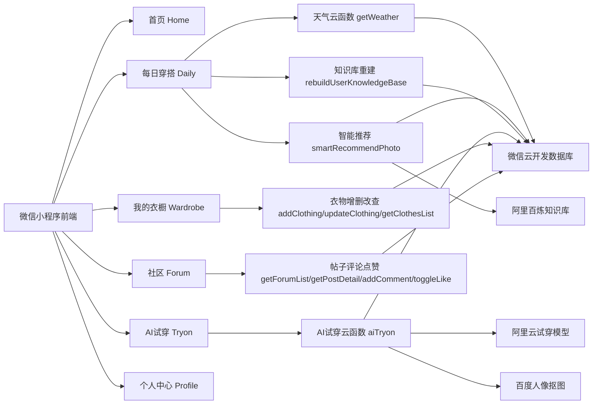

# 《场景化智能衣橱》PPT文案（比赛/答辩版）

> 适用项目：`smart-closet` 微信小程序  
> 适用场景：课程答辩、创新创业比赛、作品展示  
> 建议页数：12~14 页  
> 说明：以下文案已结合你当前项目中的真实页面、云函数、推荐链路、AI 试穿、社区互动与测试目录编写；其中“赛道名称”“团队成员”等信息请按实际情况替换。

---

## 一、PPT整体风格建议

- **主题色**：延续项目现有风格，建议使用 **白色 + 浅灰 + 粉蓝渐变**
  - 主背景：`#FFFFFF`
  - 辅助底色：`#F6F7F9`
  - 强调渐变：`linear-gradient(135deg, #FFE8E8 0%, #E0F1FF 100%)`
- **关键词风格**：轻量、智能、时尚、女性化、生活方式
- **排版建议**：
  - 一页只讲一个重点
  - 多用流程图、模块图、卡片图
  - 代码只截取“最能体现技术亮点的 5~15 行”

---

## 二、推荐PPT页结构总览

1. 封面  
2. 背景与现状  
3. 作品结构  
4. 设计理念  
5. 设计难点一：多源服饰数据治理  
6. 设计难点二：场景化智能推荐与知识库构建  
7. 设计难点三：AI试穿链路与交互编排  
8. 设计难点四：社区互动与高响应体验  
9. 使用工具与技术栈  
10. 应用与价值（一）：用户价值  
11. 应用与价值（二）：平台与行业价值  
12. 团队分工  
13. 演示路径/结尾页（可选）  
14. 附录代码页（可选）

---

# 第1页｜封面

## 标题
**场景化智能衣橱——基于微信小程序的智能穿搭管理与AI试穿系统**

## 副标题
- 参赛赛道：**【请替换：如人工智能应用赛道 / 数字生活服务赛道 / 移动应用创新赛道】**
- 团队名称：**【请替换】**
- 学校/学院：**【请替换】**
- 答辩人：**【请替换】**

## 页面可放内容
- 小程序首页截图
- “每日穿搭 / AI试穿 / 社区 / 我的衣橱”四个核心页面拼图

## 可直接讲述的话术
我们团队设计并实现了一款面向日常穿搭场景的微信小程序——“场景化智能衣橱”。作品以“衣物数字化、推荐智能化、试穿可视化、分享社区化”为核心，打通了用户从衣物上传、标签管理、天气感知、智能推荐、AI试穿到社区分享的完整闭环，旨在解决传统穿搭管理中“衣服很多、不会搭配、试错成本高、缺乏个性化建议”等问题。

---

# 第2页｜背景与现状

## 页面标题
**从“有衣可穿”到“会穿、好穿、少浪费”：智能穿搭管理的现实需求**

## 页面正文（可直接放PPT）
- 服饰消费持续存在，但用户在日常生活中仍面临以下痛点：
  1. **衣物数量多但管理分散**：拍照、分类、查找成本高
  2. **穿搭决策依赖经验**：天气、场景、风格很难同时兼顾
  3. **线上选衣试错成本高**：仅靠想象难判断上身效果
  4. **社交分享与个性表达不足**：穿搭内容缺少沉淀与互动
- 因此，需要一个将 **衣橱数字化、推荐智能化、试穿可视化、交流社区化** 融合的一体化产品。

## 可引用表述（适合做小字脚注）
- 《“十四五”数字经济发展规划》强调推进数字生活服务与场景创新。  
- 国家统计局数据显示，**2024年全国居民人均衣着消费支出为1521元，同比增长2.8%**。  
- 这说明衣着消费需求仍在，但消费后的“管理、搭配、体验”环节仍有明显数字化升级空间。

## 讲述话术
传统衣橱管理停留在线下，信息是碎片化的；而用户真正需要的，不只是“存衣服”，而是围绕天气、场景、个人偏好生成“今天该怎么穿”的有效答案。我们项目的价值，就在于把静态衣物资源转化为可计算、可推荐、可试穿、可分享的数字资产。

---

# 第3页｜作品结构

## 页面标题
**作品整体结构：前端交互 + 云端数据 + AI能力 + 社区闭环**

## 页面核心内容
你的项目当前已形成 **20个页面 + 29个云函数 + 28个测试文件** 的完整结构，可按下图展示：



## 可直接讲述的话术
在系统结构上，我们采用“小程序前端 + 微信云开发后端 + 外部AI服务”的组合模式。前端负责用户交互与体验，云函数负责业务逻辑与数据读写，外部AI服务负责完成智能推荐、图像分割与试穿生成。这样既兼顾开发效率，又能快速落地复杂的智能功能。

---

# 第4页｜设计理念

## 页面标题
**设计理念：以“场景驱动的个性穿搭服务”为核心**

## 页面文案
本作品的核心设计理念可以概括为：

> **以场景化需求为核心，以数字化衣橱为基础，以知识库推荐与AI试穿为能力支撑，构建“管理—推荐—体验—分享”一体化智能穿搭服务。**

## 三个设计亮点
### 1. 衣橱数字化
- 通过上传、抠图、分类、标签化，把衣物从“实物”转为“结构化数据”

### 2. 场景智能化
- 引入天气、用户输入需求、风格偏好、衣物标签，形成可计算推荐

### 3. 结果可视化
- 用 AI 试穿替代纯文字建议，让推荐结果从“看不见”变成“可预览”

## 三大设计重难点
- **多源异构数据治理**
- **知识库驱动的个性化推荐**
- **复杂交互链路下的流畅体验控制**

## 讲述话术
我们不是单纯做一个“衣服记录本”，也不是单纯做一个“图片试穿工具”，而是希望围绕真实生活场景，把衣物管理、推荐决策、视觉验证和社交反馈整合起来，形成完整的服务闭环。

---

# 第5页｜设计难点一：多源服饰数据治理

## 页面标题
**设计难点一：多源异构服饰数据治理，完成从原始图片到可检索衣物资产的转化**

## 页面可放要点
- 用户拍照/相册导入的都是 **非结构化图片**
- 图片来源不同，可能是：
  - 本地临时路径
  - `cloud://` 云存储链接
  - 第三方返回的 `http/https` 图片
- 如果不做治理，会导致：
  - 图片显示异常
  - 无法长期访问
  - 无法参与后续智能推荐与知识库检索

## 你的项目解决方案
1. **上传原始图片到云存储**  
   页面：`pages/uploadClothes/uploadClothes.js`
2. **调用阿里云图像分割能力做衣物抠图**  
   工具：`utils/aliyun-image-segmentation.js`
3. **将第三方返回图片重新转存到微信云存储**  
   页面：`pages/clothingInfo/clothingInfo.js`
4. **补充结构化标签与检索文本**  
   云函数：`cloudfunctions/addClothing/utils/retrieval-profile.js`

## 适合放在PPT上的代码
```javascript
function buildKnowledgeSyncFields(payload = {}) {
  const image = normalizeText(payload.image)
  const userTags = normalizeTagList(payload.tags)
  const inferredProfile = buildInferredProfile(payload)
  const mergedTags = buildMergedTags(payload)

  return {
    retrieval_tags: mergedTags,
    retrieval_text: buildRetrievalText(payload),
    knowledge_sync_status: image ? 'pending' : 'skipped_no_image'
  }
}
```

## 这段代码想表达什么
- 不是简单保存一张衣服图片
- 而是把衣物进一步转成：
  - **用户标签**
  - **推断风格画像**
  - **统一检索标签**
  - **可进入知识库的文本描述**

## 讲述话术
这一页体现的是项目的数据底座能力。我们把“衣服图片”升级成“可被机器理解的衣物档案”，为后续的推荐、检索和试穿提供了统一的数据基础。

---

# 第6页｜设计难点二：场景化智能推荐与知识库构建

## 页面标题
**设计难点二：知识库驱动的场景推荐，实现“懂天气、懂需求、懂衣橱”的智能决策**

## 页面要点
项目不是做通用问答，而是做 **强约束的穿搭推荐**。  
推荐需要同时考虑：

- 当前天气与城市
- 用户自然语言需求
- 用户私人衣橱中的真实衣物
- 衣物风格、颜色、场景标签
- 衣物是否已完成知识库同步

## 你的项目链路
### 前端触发
- 页面：`pages/daily/daily.js`
- 先调用 `getWeather`
- 再构造推荐请求 payload
- 调用 `smartRecommendPhoto`

### 后端执行
- 云函数：`cloudfunctions/smartRecommendPhoto/index.js`
- 核心步骤：
  1. 校验用户输入
  2. 绑定个人知识库
  3. 拉取用户衣橱
  4. 同步待入库衣物
  5. 基于知识库返回推荐结果

## 推荐放图
- “天气 → 用户需求 → 知识库检索 → 推荐结果卡片 → 一键跳转试穿”流程图

## 适合放PPT的代码
```javascript
const syncSummary = await syncPendingClothesToKnowledge({
  db,
  knowledgeId: binding.knowledgeId,
  clothesList,
  provider: knowledgeProvider,
  maxItems: 3
})

recommendation = await buildKnowledgeRecommendation({
  provider: knowledgeProvider,
  binding,
  clothesList,
  event,
  userQuery
})
```

## 技术亮点总结
- **把私人衣橱接入知识库，不再依赖公共模板推荐**
- **支持增量同步与失败诊断，而不是一次性粗暴重建**
- **推荐结果可直接反向驱动试穿页面，实现“建议—验证”联动**

## 讲述话术
本项目最核心的创新点，是把用户自己的衣服组织成一个可检索、可计算的知识库，让推荐结果不再停留在“泛泛而谈”，而是建立在“你真实拥有的衣服”之上。

---

# 第7页｜设计难点三：AI试穿链路与交互编排

## 页面标题
**设计难点三：AI试穿链路编排，打通人物形象、衣物选择与生成结果预览**

## 页面问题定义
AI试穿不是只调用一个模型接口，而是一个长链路问题：

- 用户要先设置形象图
- 从衣橱中选择上衣/下装
- 前端要支持拖拽、摆放、缩放
- 后端要把 `cloud://` 文件转为临时 https 链接
- 再调用试穿模型生成图片
- 最后还要做透明图抠出，增强视觉体验

## 你的项目实现
### 前端
- 页面：`pages/tryon/tryon.js`
- 功能：
  - 衣物筛选
  - 画板拖拽/缩放
  - 试穿生成
  - 结果跳转预览

### 后端
- 云函数：`cloudfunctions/aiTryon/index.js`
- 链路：
  1. `cloud.getTempFileURL`
  2. 调用阿里试穿模型 `aitryon`
  3. 轮询异步任务
  4. 调用百度人体分割
  5. 返回原图 + 透明图

## 可展示代码
```javascript
const aiRes = await wx.cloud.callFunction({
  name: 'aiTryon',
  data: { 
    personImageFileID, 
    topGarmentFileID, 
    bottomGarmentFileID 
  }
})
```

```javascript
const createRes = await axios.post(
  'https://dashscope.aliyuncs.com/api/v1/services/aigc/image2image/image-synthesis',
  {
    model: 'aitryon',
    input: modelInput
  }
)
```

## 本页建议强调的小标题
- **跨平台图像资源调度**
- **异步任务轮询与状态控制**
- **沉浸式视觉验证体验**

## 讲述话术
我们把 AI 试穿设计为一个完整的视觉验证模块，而不是孤立接口。用户既可以先获得智能推荐，再一键跳转到试穿页；也可以手动选衣、拖拽组合，最后生成可预览的上身效果，从而显著降低穿搭决策的不确定性。

---

# 第8页｜设计难点四：社区互动与高响应体验

## 页面标题
**设计难点四：高频互动场景下的流畅体验设计，构建“内容分享—反馈沉淀”社区闭环**

## 页面可放要点
社区模块不仅是展示区，也是推荐系统外部反馈的重要入口。  
当前项目已实现：

- 社区帖子列表：`pages/forum/forum.js`
- 帖子详情：`pages/postDetail/postDetail.js`
- 发帖编辑：`pages/postEdit/postEdit.js`
- 一级评论、二级回复、点赞、收藏
- 用户反馈页：`pages/feedback/feedback.js`

## 技术亮点
### 1. 秒开体验
- 列表页将当前帖子数据打包传递给详情页
- 先渲染缓存，再静默拉取最新数据

### 2. 乐观更新
- 点赞/收藏先更新前端状态，再异步同步云端
- 明显降低点击等待感

### 3. 数据一致性维护
- 页面退出时，反向更新上一页列表的点赞与收藏状态

## 适合放PPT的代码
```javascript
this.setData({
  'post.liked': !curLiked,
  'post.likes': !curLiked ? curLikes + 1 : Math.max(0, curLikes - 1)
})
```

## 本页适合使用的小标题
- **高频交互下的即时反馈机制**
- **社区化内容沉淀与用户参与**
- **前后端状态一致性控制**

## 讲述话术
很多作品只做功能，不做体验；但在真实产品里，用户对“顺不顺手”的感知非常强。我们通过秒开、乐观更新和页面间静默同步等方式，把社区互动做得更接近真实应用。

---

# 第9页｜使用工具与技术栈

## 页面标题
**工具链与实现路径：从前端交互到云端AI的完整工程化组合**

## 可直接放PPT的表格

| 环节 | 工具/技术 | 在本项目中的作用 |
|---|---|---|
| 前端开发 | 微信小程序原生框架 | 页面搭建、交互实现、组件逻辑 |
| 样式实现 | WXSS | 构建清爽、轻量的时尚化界面 |
| 业务逻辑 | JavaScript | 页面状态管理、事件处理、数据流转 |
| 云开发 | 微信云开发 / 云函数 | 登录、数据库访问、业务接口封装 |
| 数据存储 | 云数据库 + 云存储 | 用户、衣物、帖子、评论、图片资源持久化 |
| 天气服务 | 高德天气API | 基于城市/定位获取实时天气 |
| 图像分割 | 阿里云 DashScope | 服饰抠图与图像处理 |
| 智能推荐 | 阿里百炼知识库 | 基于私人衣橱的场景化检索与推荐 |
| AI试穿 | 阿里云试穿模型 | 生成人物穿搭结果图 |
| 人像抠图 | 百度AI | 输出透明人像图，增强预览效果 |
| 测试保障 | `tests/` 目录 28 个测试文件 | 覆盖推荐、知识库、天气、试穿映射等逻辑 |

## 可补充一句
项目当前共包含 **20个页面、29个云函数、28个测试文件**，体现了较完整的前后端协同与工程组织能力。

---

# 第10页｜应用与价值（一）：用户价值

## 页面标题
**应用与价值（一）：提升普通用户的穿搭效率与体验质量**

## 页面文案
本作品对用户的直接价值主要体现在四个方面：

### 1. 衣橱管理价值
- 让用户告别“衣服很多但找不到、记不清、搭不出”的低效状态

### 2. 决策辅助价值
- 结合天气、场景、偏好与库存，给出更贴近真实生活的建议

### 3. 体验验证价值
- AI试穿让用户在决策前先看到效果，减少穿搭试错成本

### 4. 表达与社交价值
- 社区让用户可以展示穿搭、获取反馈、沉淀内容与审美偏好

## 可直接讲述的话术
对普通用户而言，这个系统不只是“记衣服”，而是帮助他更高效地完成每天的穿搭决策，并提升自我表达与审美管理能力。

---

# 第11页｜应用与价值（二）：平台与行业价值

## 页面标题
**应用与价值（二）：为数字生活服务与智能穿搭平台提供可扩展能力**

## 页面文案
从更广的角度看，本作品还具备平台化和行业化延展空间：

### 1. 可扩展为个人穿搭助手平台
- 未来可进一步接入日历、行程、温度趋势、风格画像

### 2. 可服务电商与内容平台
- AI试穿与社区内容可延伸至商品导购、内容种草、搭配推荐

### 3. 可支持绿色消费与理性消费
- 通过激活已有衣物价值，减少重复购买与闲置浪费

### 4. 可形成用户画像与推荐数据闭环
- 从衣物标签、穿搭选择、社区反馈中持续优化推荐效果

## 本页适合的小标题
- **从工具型产品走向平台型能力**
- **从衣物管理走向智能生活服务**

---

# 第12页｜团队分工

## 页面标题
**团队分工：围绕“产品—前端—云端—AI—测试”协同推进**

## 建议排版
- 左侧放团队合影（注意不带学校敏感信息）
- 右侧放成员分工表

## 可直接使用的分工模板

| 成员 | 分工方向 | 具体内容 |
|---|---|---|
| 成员A | 产品/统筹 | 需求分析、PPT统稿、答辩组织、演示流程设计 |
| 成员B | 前端开发 | 小程序页面搭建、交互设计、衣橱/社区/个人中心实现 |
| 成员C | 云端开发 | 云函数编写、数据库设计、登录与业务接口封装 |
| 成员D | AI能力接入 | 图像分割、知识库同步、智能推荐、AI试穿链路打通 |
| 成员E | 测试与优化 | 用例设计、异常处理、交互细节打磨、文档整理 |

## 可直接讲述的话术
本项目不是单点开发，而是产品设计、前端实现、云端接口、AI能力接入与测试优化协同完成的结果，体现了较强的团队配合与工程组织能力。

---

# 第13页｜演示路径（可选）

## 页面标题
**现场演示建议：3分钟走完完整业务闭环**

## 推荐演示顺序
1. 登录进入首页  
2. 进入“上传衣物”页面，展示拍照/相册导入  
3. 展示衣物信息录入与衣橱分类效果  
4. 进入“每日穿搭”，展示天气获取与自然语言输入  
5. 展示智能推荐结果卡片  
6. 一键跳转试穿页，展示画板选衣与AI试穿  
7. 打开社区页，展示帖子、评论、点赞、收藏  
8. 回到“我的”，展示个人资料与反馈页面

## 演示提示
- 如果现场网络一般，提前准备截图或录屏
- 推荐重点演示“推荐→试穿→社区”三段联动

---

# 第14页｜附录代码页（可选）

## 附录主题
**核心代码支撑：项目不是概念设计，而是已完成核心功能落地**

## 可选代码1：启动即静默登录
文件：`app.js`
```javascript
const res = await wx.cloud.callFunction({ name: 'login' })
if (result && result.code === 200) {
  this.globalData.currentUserInfo = userInfo
  this.globalData.currentUserId = userInfo.id || userInfo._id
}
```

## 可选代码2：天气感知推荐入口
文件：`pages/daily/daily.js`
```javascript
wx.cloud.callFunction({
  name: 'getWeather',
  data: params
})
```

## 可选代码3：推荐结果直达试穿
文件：`pages/daily/daily.js`
```javascript
wx.setStorageSync('smartRecommendTryonEntry', {
  source: 'smartRecommend',
  selectedClothesIds: result.selectedClothesIds,
  active: true
})
```

## 可选代码4：试穿调用
文件：`pages/tryon/tryon.js`
```javascript
const aiRes = await wx.cloud.callFunction({
  name: 'aiTryon',
  data: { personImageFileID, topGarmentFileID, bottomGarmentFileID }
})
```

---

## 三、答辩时可重点强调的“项目关键词”

建议在整套 PPT 中反复强化以下表达：

- **场景化穿搭服务**
- **私人衣橱数字化**
- **知识库驱动推荐**
- **多源异构服饰数据治理**
- **沉浸式AI试穿体验**
- **社区化内容反馈闭环**
- **微信云开发快速落地**
- **工程化测试与持续优化**

---

## 四、如果你要进一步美化PPT，建议补充的素材

### 必放截图
- 首页
- 每日穿搭页
- 推荐结果卡片
- AI试穿页
- 社区页
- 我的衣橱页

### 建议补充的图
- 系统结构图
- 用户流程图
- 试穿前后对比图
- 推荐链路图
- 团队合影

---

## 五、你答辩时的一句总结

**我们的作品不是把“衣服”搬到线上，而是把“穿搭决策”变成一个可感知、可计算、可验证、可分享的智能服务过程。**

